## What STRATA Means

STRATA stands for **Signal, Timing, Risk, Allocation, Trade Automation**.

It reflects the platform workflow:

- **Signal**: identify opportunities from live/backtest analytics
- **Timing**: align entries/exits to timeframe and regime
- **Risk**: enforce stops, exposure limits, and guardrails
- **Allocation**: size positions using balance, confidence, and constraints
- **Trade Automation**: stage, approve, execute, reconcile, and monitor

## Architecture Docs

- HLD Diagram: [HLD_Diagram.svg](./HLD_Diagram.svg)
- High-Level Design: `docs/HLD.md`
- Detailed Design: `docs/DETAILED_DESIGN.md`



## Release & Branch Strategy (Best Practice)

Use separate long-lived branches for release channels:

- **`main`** -> stable production-ready STRATA channel (GUI-first)
- **`ai-nightly`** -> active development/nightly channel for latest AI/GUI capabilities
- **`archive/*`** -> historical snapshots of previous branch eras (read-only by convention)

Recommended workflow:

1. Develop features on short-lived feature branches.
2. Merge feature branches into `ai-nightly`.
3. Promote tested `ai-nightly` builds into `main` via fast-forward merge.
4. Tag milestone releases on `main` (for example `v0.9.0-gui-primary`).

### Promotion Guardrail (`ai-nightly` -> `main`)

Promote with a clean, fast-forward merge to keep release history easy to audit:

```bash
git switch main
git merge --ff-only ai-nightly
git push origin main
```

Detailed policy: `docs/BRANCH_SYNC.md`

## Script Layout

To mirror the channels in the repo structure:

- **Stable script:** `stable/BTC3.py`
- **Nightly script:** `nightly/BTC-beta.py`

## Requirements

Install dependencies:

```bash
pip install pandas numpy plotly yfinance requests pandas_ta optuna
```

Python:

- Nightly script targets **Python 3.13+** and is primarily tested on **3.13.x**.

Optional acceleration dependency:

```bash
pip install cupy-cuda12x
```

If CuPy/CUDA is not available, nightly falls back to CPU automatically.

## Running

Stable channel (`main` branch target):

```bash
python stable/BTC3.py
```

Nightly channel (`nightly` branch target):

```bash
python nightly/BTC-beta.py
```

GUI (ai-nightly branch):

```bash
python scripts/run_gui.py
```

GUI task execution:

- Default mode runs one active task at a time (additional tasks are queued).
- Optional `Advanced Mode: Parallel jobs (experimental)` can be enabled in GUI Settings to allow limited concurrent jobs.
- Use the top `Tasks` button or the `Task Monitor` tab to view task status.
- `Task Monitor` tab supports:
  - auto-refresh (~1s) for running/queued state
  - live running/queued visibility
  - pause/resume queue
  - remove queued task
  - queued task reprioritization (move up/down)
  - terminal-style live log pane for task start/completion and captured backend output

Live Dashboard preset management:

- Preset/profile controls are available directly in the `Live Dashboard` tab.
- Supports:
  - save/update profile from selected panel(s)
  - save/update profile from all current panels
  - load single profile (replace current panels)
  - merge multiple selected profiles (append)
  - delete multiple selected profiles

GUI dashboard readability:

- Live/Backtest text outputs now apply color highlighting for key sections and action states (`BUY/HOLD/SELL`) to improve scanability.
- Major GUI tabs now support both vertical and horizontal scrolling at tab level, improving access to full config/action areas on smaller screens.
- Console usability/debugging:
  - right-click context menu on text consoles (`Copy`, `Select All`, `Clear`)
  - `Ctrl+A` / `Ctrl+C` support in text areas, and copy-selected-row support in tables
  - dedicated copy buttons for Live/Backtest/AI/Task/Settings consoles
  - optional `Verbose terminal logging (debug mode)` in Settings for deeper task/runtime traces

GUI AI configuration:

- AI profiles can now be managed directly in GUI Settings:
  - list/select profile
  - update provider/model/endpoint/internet mode/temperature
  - set active profile
  - store/remove API key securely
  - test profile connectivity
- GUI uses the same user-local secure preference/secret files as CLI mode.
- AI source options include `live_all_panels` to aggregate the latest GUI live panel outputs (e.g., 4h + 12h) into one analysis input.
- New AI pipeline option: `Run Live->Backtest->AI`
  - captures current live dashboard snapshot
  - runs targeted backtests on assets currently signaled in live output (grouped by market/timeframe)
  - sends combined live + targeted-backtest context to AI for recommendation generation
- New `Agent Console` tab (natural-language command center):
  - `plan` mode: analysis + staged recommendations only
  - `semi_auto` mode: stage + auto-size
  - `auto_execute` mode: stage + auto-size + submit
  - optional execution guardrails:
    - max daily realized loss threshold
    - max trades per day
    - max open exposure threshold
    - optional requirement that BUY actions include a protective stop
  - supports intents such as:
    - "find best buys top 10 crypto on 4h"
    - "buy btc 10% capital stop loss 5%"
    - "buy 10 usdt of btc with stop loss 5%"
    - "buy btc with 30% of my usdt"
    - "with my current usdt, look for signals and allocate buy strategy"
    - "do a comprehensive search for top 5 coins ... expand search until found"
    - "open detailed view" (jumps to Portfolio & Ledger tab)
    - "run every 30 minutes" / "pause scheduler" / "stop scheduler" / "agent status"
    - "exclude TRX DOGE" / "clear exclusions"
    - "execute staged"
    - "show pnl" / "pnl today" / "pnl last 10 trades"
  - agent now emits a deterministic plan card before staging/execution so parsed intent is transparent.
  - optional `AI fallback` in Agent Console:
    - deterministic parser runs first
    - ambiguous commands are sent to the active AI profile to produce strict structured intent JSON
    - all resulting actions still pass normal STRATA validation/guardrails before execution
  - agent context memory persists across runs (timeframe, top-N, quote, stop %, exclusions).
  - `Execute Last Staged` button in Agent Console accelerates review->size->submit workflow.

Quote lock + local-currency ledger:

- In GUI Settings:
  - set `Primary Quote` (for example `USDT`, `USDC`, `FDUSD`)
  - enable `Lock primary quote across crypto dashboards/trades`
- When enabled, crypto live dashboards/backtests/trade-plan symbol normalization are aligned to the selected primary quote.
- Ledger execution rows now carry:
  - `quote_currency` (execution quote, e.g. `USDT`)
  - `display_currency` (user local currency from Settings, e.g. `AUD`/`JPY`)
  - realized `pnl_quote` and converted `pnl_display` (when quote is USD-like).
- AI analysis prompt now requests a bottom-section implementation snippet (`Recommended API Snippet`) with duplicate-signal guard, entry/exit branches, and minimal ledger logic.
- AI tab now supports workflow automation:
  - `Auto-stage signals` after AI response
  - optional `Log AI signals to ledger`
  - `Run Live->AI Pipeline` (run dashboards, then AI on combined panel outputs)
  - pipeline scheduler (interval in minutes) for continuous operation during runtime
  - AI output contract now supports dual format:
    - human-readable interpretation at top
    - machine-readable footer between:
      - `BEGIN_STRATA_TRADE_PLAN_JSON`
      - `END_STRATA_TRADE_PLAN_JSON`
    - structured trades from this footer are parsed directly into pending recommendations for Portfolio/Ledger workflow

GUI Portfolio & Ledger:

- New `Portfolio & Ledger` tab:
  - Binance account portfolio snapshot (balances + estimated USD value)
  - `Reconcile Fills` action to backfill missing execution rows/open positions from Binance trade history
  - `Protect Open Positions (AI+BT)` action:
    - analyzes current open positions
    - includes targeted backtest context for each open symbol/timeframe
    - requests AI protection plan (`SET_STOP` / `SET_TRAILING` / `SET_TAKE_PROFIT` / `SET_BOTH` / `HOLD`)
    - stages protective `STOP_LOSS_LIMIT` and `TAKE_PROFIT_LIMIT` sell orders for review/submit
    - trailing recommendations currently map to fixed-stop execution for compatibility (annotated in reason)
  - Protection monitor controls:
    - configurable interval (`Protect every (min)`)
    - `Start/Stop Protect Monitor`
    - optional `Auto-send protection` to submit newly staged protective orders without confirmation prompts
  - Protection generation now runs as a background task to avoid GUI freeze during heavy AI/backtest processing.
  - `Review Open Positions (MTF)` action:
    - evaluates open-position assets across `4h/8h/12h/1d`
    - logs per-timeframe actions and vote-based stance (`HOLD/ADD`, `HOLD`, `REDUCE/EXIT`)
  - Signal import from latest live dashboard output
  - Duplicate-signal activity guard (cooldown-based) to reduce repeated same-signal actions
  - Manual ledger event entry (`BUY/SELL/HOLD`)
  - Current open-position tracking + historical ledger view
  - AI recommendation staging queue with selective approval/submit flow
  - Pending queue can now size selected rows by quote notional target (for example USDT amount) instead of raw qty
  - Pending table shows estimated quote notional and symbol min-notional for faster filter debugging
  - auto-sizing for selected pending trades:
    - BUY uses configurable `%` of available quote balance (for example USDT)
    - SELL uses configurable `%` of available base-asset balance
    - optional confidence weighting from AI recommendation confidence
    - final quantity is validated/normalized against Binance symbol filters before submit
  - direct import of AI-interpreted signals into pending queue (with optional ledger logging)
  - open Binance order list + cancel selected orders from GUI
  - incremental table refresh for pending recommendations/open orders (reduces redraw churn)
  - execution modes: `manual`, `semi_auto`, `full_auto` (mode-controlled behavior)
  - optional protective order placement on BUY execution:
    - if AI structured recommendation includes `invalidation`/`stop_loss_price`, GUI stores it
    - if AI/backtest context provides take-profit levels, GUI also stores `take_profit_price`
    - when both stop and take-profit are present, submit flow now prefers Binance `OCO` SELL bracket (TP + SL linked)
    - if OCO fails, workflow falls back to separate protective order placement
  - Binance pre-submit order validation against exchange filters:
    - quantity step size / min-max qty
    - limit-price tick size / min-max price
    - notional constraints (`MIN_NOTIONAL`/`NOTIONAL`)
    - auto-normalization (round-down to valid increment) before submit
  - ledger open-position safety:
    - only execution-grade events (`is_execution=true` with non-zero qty) create/close open positions
    - signal-only entries (e.g., AI interpretation/imported signals) are kept in history but do not pollute open positions

Performance & Profiling:

- Engine bridge now reuses short-lived in-memory caches for:
  - fetched raw market data
  - indicator cache outputs
  - live/backtest result payloads
- Shared data-loading paths reduce duplicate work between Live, Backtest, and pipeline runs.
- Task Monitor now shows:
  - running task IDs + start timestamps
  - recent completed-task durations
  - rolling recent average duration
- Task terminal emits `PERF ...` lines for Live/Backtest/AI pipeline stages.
    - invalid legacy zero-qty open positions are auto-cleaned on ledger read
  - ledger views now split into:
    - `Overall`
    - `Signal Journal`
    - `Execution Ledger`
- Binance profiles can be managed in GUI Settings (similar to AI profiles):
  - create/update/set active/delete profile
  - secure key+secret storage outside repo
  - profile connectivity test

GUI traditional-region UX:

- Country selector now uses readable region names (not numeric-only codes).
- Selector is searchable by typing.
- Manual country-code override field is available for advanced use.

## Nightly Highlights (`nightly/BTC-beta.py`)

- User-selectable analysis interval: `1d`, `4h`, `8h`, `12h`
- Backtest lookback selector: `1/3/6/12/18/24 months`
- Traditional market top-list selector expanded to `Top 10/20/50/100` (region-based curated universes)
- Crypto quote currency selector: `USD / USDT / BTC / ETH / BNB`
- Display currency selector for comparative reporting (e.g., AUD/EUR/GBP/JPY) with USD FX conversion
- Accurate period math using `365.25` days/year
- Dynamic Fibonacci swing detection with support/resistance guards
- ATR/ADX/OBV/CMF risk-scoring integration
- Live setup analytics and reliability scoring:
  - regime tagging (`Trending`, `Choppy`, `High-Vol`, `Transitional`)
  - setup expectancy/win-rate/false-signal estimates
  - risk-cone and post-entry drawdown context
- Portfolio-aware live context:
  - concentration warning based on rolling correlations
  - lower-correlation alternatives to top-ranked asset
- Walk-forward auto-tuning with Optuna
- Hard risk constraints in tuning:
  - validation fold drawdown constraint (trials are pruned when exceeded)
  - position-size search bounded by configured max exposure
  - safe fallback when all trials are pruned (uses base config)
- Optional post-tune constrained retry in backtest mode:
  - if final-window drawdown exceeds target, a tighter exposure re-tune pass is attempted
- CPU parallelism:
  - Indicator cache build worker selection
  - Optuna trial parallel jobs
- CUDA detection via CuPy with safe CPU fallback
- Binance symbol pre-filtering using `exchangeInfo` to reduce bad ticker noise
- Crypto fetch behavior by quote:
  - all quotes use Binance first
  - yfinance fallback is used for `-USD` pairs; non-USD quotes remain Binance-first only
- Backtest churn controls:
  - `min_hold_bars` before signal exits
  - `cooldown_bars` after exits
  - same-asset re-entry cooldown bars
  - max consecutive same-asset entries
- Action-label UI fallback:
  - auto-detects terminal support for emoji and ANSI color
  - falls back to plain text labels if unsupported
  - optional env override: `STRATA_DISABLE_EMOJI=1` (legacy `CTMT_DISABLE_EMOJI=1` also supported)
  - optional color controls: `NO_COLOR=1` or `FORCE_COLOR=1`
- Built-in AI analysis mode:
  - paste full raw dashboard text and generate a Grok-ready analysis prompt
  - optional direct call to active AI provider profile (cloud or local)
  - prompt now requests a simple short-term vs long-term entry/exit/invalidation guide
  - saves prompt/response artifacts under `experiments/grok/`
- Multi-provider AI integration:
  - xAI, OpenAI, Anthropic, Ollama, OpenAI-compatible, OpenClaw
  - in-app profile management and active-profile switching
  - secure user-local preference/key storage outside repo
  - per-profile internet mode toggle (online-aware vs offline-aware prompting)
  - per-profile model update (e.g., set Ollama profile to DeepSeek)

## Notes

On first run, the scripts will create/use `crypto_data.db` and populate market data.
Subsequent runs are faster due to caching.

## Automated Research Loop

You can now run unattended experiment cycles that:

1. Execute scheduled backtests + Optuna studies across `experiments/scenarios.json`
2. Log artifacts into `experiments/runs/` and `experiments/candidates.jsonl`
3. Promote winners into `experiments/registry/champions.json` using risk gates
4. Refresh the automation section in `PROJECT_HANDOFF.md`

Commands:

```bash
python scripts/run_experiments.py --enable-optuna
python scripts/promote_champion.py
python scripts/update_handoff.py
```

One-shot orchestrator:

```bash
python scripts/auto_research_cycle.py
```

Windows Task Scheduler helper:

```powershell
powershell -ExecutionPolicy Bypass -File .\scripts\register_research_task.ps1 -TaskName STRATA_Nightly_Research -Time 02:00 -PythonExe python
```

Promotion gates (`scripts/promote_champion.py`) are conservative by default:

- minimum return improvement: `+1.0%`
- maximum drawdown increase allowed vs champion: `+1.5%`
- maximum sharpe drop allowed vs champion: `-0.10`

Detailed automation reference: `docs/AUTOMATION.md`

Bug tracking references:

- `docs/BUG_SCORECARD.md` (generated build-by-build + aggregate view)
- `docs/BUG_SCORECARD_DATA.json` (source data)

Refresh command:

```bash
python scripts/update_bug_scorecard.py
```

From nightly main menu you can run:

- `7. Run Auto-Research (Standard)` -> existing cycle script
- `8. Run Auto-Research (Comprehensive)` -> generated scenario sweep across all timeframes and lookback windows for selected market scope

### Runtime Champion Suggestions

`nightly/BTC-beta.py` now reads `experiments/registry/champions.json` at runtime and tries to match the current context:

- market (`crypto` / `traditional`)
- timeframe (`1d`, `4h`, `8h`, `12h`)
- backtest lookback months (when in backtest mode)
- approximate asset count context

When a match is found, the script shows champion metrics and prompts to apply:

- Live mode: apply champion tuned parameters for scoring.
- Backtest mode: replace entered settings with champion config.

## AI Analysis Mode

From nightly main menu select:

- `4. AI Analysis Mode`
- `5. AI Provider Settings` (configure provider/model/endpoint/keys/presets)

Flow:

1. Enter date/time context (or accept default).
2. Choose source:
   - paste dashboard output manually, or
   - use latest saved Live Dashboard snapshot.
   - use latest saved Backtest snapshot.
3. If pasting manually, enter `END` on a new line.
4. Choose whether to send directly to active AI provider profile.

Live snapshots are auto-saved every time Live Dashboard runs:

- `experiments/live_snapshots/live_dashboard_<timestamp>.txt`
- `experiments/live_snapshots/latest_live_dashboard.txt`

Backtest snapshots are auto-saved every time Backtest mode runs:

- `experiments/backtest_snapshots/backtest_<timestamp>.txt`
- `experiments/backtest_snapshots/latest_backtest.txt`

AI provider preferences and local keys are stored in user home (not repo):

- `%USERPROFILE%\\.ctmt\\ai_preferences.json`
- `%USERPROFILE%\\.ctmt\\ai_secrets.json`

Notes:

- Env vars still work and take precedence over stored keys when configured for a profile.
- Ollama/OpenClaw local endpoints can be configured in AI Provider Settings.

Diagnostics:

- Startup now prints active AI profile/provider/model and key source status.
- On API failure, nightly prints HTTP status and truncated response body.
- xAI profile includes model alias fallback attempts for invalid-model 400/404 cases.

### AI Provider Presets

In `AI Provider Settings`, use quick-start presets for:

- xAI Cloud (Grok)
- OpenAI Cloud
- Anthropic Cloud
- Ollama Local
- OpenClaw Local (OpenAI-compatible)
- OpenAI-compatible Custom

Offline prompt behavior:

- Profiles marked `offline-aware` use an offline-safe system prompt (explicitly no live internet/news assumptions).
- Profiles marked `online-aware` use the existing online Grok-style system prompt.

Ollama behavior:

- Nightly will try to call local Ollama directly.
- If unreachable, it attempts to start `ollama serve` automatically.
- If model is missing, it attempts auto-pull (`OLLAMA_AUTO_PULL=1` by default).


